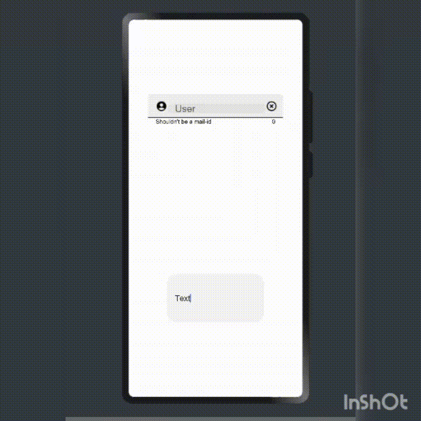
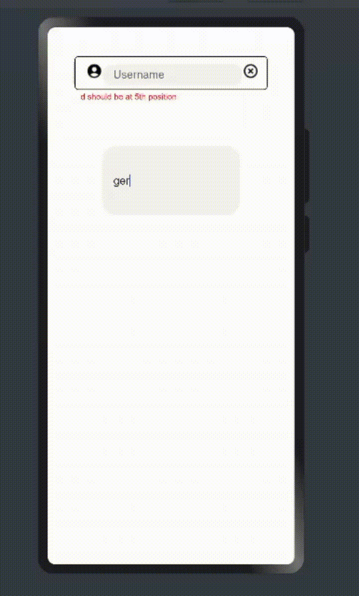
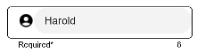
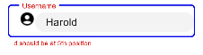

## Material_UI_TextField
### Features
      1. Labeled and Non-Labeled TextFields
      2. Assistive elements like Helper Text and Character Counter
      3. Leading and Trailing Icons to help user to understand the type of input expected
      4. Error Message assistance to check and verify the type of input required
### Exemplary Images
Defocused Textfields:

   

Focused TextFields:

     
   

   

### Dependencies
      Add following to the dependencies in package.json file of your project: "@ohos/MaterialTextField": "file:../MaterialTextField"
            
      "dependencies": {
            ...
            "@ohos/MaterialTextField": "file:../MaterialTextField"
      }
### Import and install 
### APIs
      MaterialTextField({textFieldType:MaterialTextFieldType,textFieldParameters:MaterialTextFieldOptions})
### Parameters
textFieldType:[MaterialTextFieldType*](README.md#MaterialTextFieldType)

textFieldOptions:[MaterialTextFieldOptions](README.md#MaterialTextFieldOptions)
   
#### MaterialTextFieldOptions

   |Parameter|type|Remarks|
   |-|-|-|
   |label|string|label of textfield|
   |leadingIcon|Resource|leading icon to be used|
   |trailing icon|Resource|trailing icon to be used|
   |characterCounter|boolean|characterCounter enabled when true|
   |maxCharacters|number|max number of characters allowed|
   |helperText|string|used as a hint for input text|
   |textInputOptions|[Object{}](README.md#textinputoptions)|text input options|
   |margin|Length or Padding|-|
   |padding|Length or Padding|-|
   |border|[BorderOptions](https://developer.harmonyos.com/en/docs/documentation/doc-references/ts-universal-attributes-border-0000001158261223)|-|
   
> Note: Parameters marked with '*' are mandatory.
   
#### MaterialTextFieldType
    1. Filled
    2. Outlined
    
#### TextInputOptions
   |Options|type|Remarks|
   |-|-|-|
   |id|string|id of textfield|
   |input|string|input|
   |placeholderText|string|placeholder of input field
   |inputType|[InputType](https://developer.harmonyos.com/en/docs/documentation/doc-references/ts-basic-components-textinput-0000001233397495#EN-US_TOPIC_0000001233397495__li1018842194211)|select one of InputType
   |placeholderFont|{ size?: Length, weight?:[FontWeight](https://developer.harmonyos.com/en/docs/documentation/doc-references/ts-universal-attributes-text-style-0000001111681086#EN-US_TOPIC_0000001111681086__li24391125115311), family?: string, style?: [FontStyle](https://developer.harmonyos.com/en/docs/documentation/doc-references/ts-universal-attributes-text-style-0000001111681086#EN-US_TOPIC_0000001111681086__li6906111945316)}|Font of placeholder|
   |placeholderColor|Color|-|
   |fontColor|Color|color of input text|
   |fontSize|number|-|
   |fontStyle|[FontStyle](https://developer.harmonyos.com/en/docs/documentation/doc-references/ts-universal-attributes-text-style-0000001111681086#EN-US_TOPIC_0000001111681086__li6906111945316)|-|
   |fontWeight|[FontWeight](https://developer.harmonyos.com/en/docs/documentation/doc-references/ts-universal-attributes-text-style-0000001111681086#EN-US_TOPIC_0000001111681086__li24391125115311)|-|
   |fontFamily|string|-|
   |enterKeyType|[EnterKeyType](https://developer.harmonyos.com/en/docs/documentation/doc-references/ts-basic-components-textinput-0000001233397495#EN-US_TOPIC_0000001233397495__li1231618102427)|enter key functionality|
   |caretColor|Color|color of cursor when input is being edited|
   
#### Atrributes
The following attributes are supported for TextFieldOptions:
|Attribute|Description|
|-|-|
|setTextFIeldType(type:MaterialTextFieldType)|sets textfield type|
|setLabel(label:string,labelWidth:number)|sets the label for textfield|
|setHelperText(text:string)|setsthe helper text|
|setCharacterCounter(enable:boolean,maxCharacters:number)|enables character counter and maximum allowed characters|
|setIcons(leadingIcon:Resource,trailingIcon:Resource)|sets leading and trailing icons|
|setTextInputOptions(textInputOptions:TextInputOptions)|sets the input text options|
|setMargin(margin:Length or Padding)|sets the margin for textfield|
|setPadding(padding:Length or Padding)|sets the padding for textfield|
|setBorder(options:BorderOptions)|sets the border parameters for textfield|
#### Events
   |Event|Description|
   |-|-|
   |onLeadingIconClick(callBack:(event:[ClickEvent](https://developer.harmonyos.com/en/docs/documentation/doc-references/ts-universal-events-click-0000001111581270#EN-US_TOPIC_0000001111581270__li155675712535))=>void)|triggered when leading icon is being clicked|
   |onTrailingIconClick(callBack:(event:[ClickEvent](https://developer.harmonyos.com/en/docs/documentation/doc-references/ts-universal-events-click-0000001111581270#EN-US_TOPIC_0000001111581270__li155675712535))=>void)|triggered when trailing icon is being clicked|
   |onChange(callBack:(event:value?:string=>void|triggered when textfield input changes|
   |onSubmit(callBack:(enterKey?:[EnterKeyType](https://developer.harmonyos.com/en/docs/documentation/doc-references/ts-basic-components-textinput-0000001233397495#EN-US_TOPIC_0000001233397495__li1231618102427))=>void|triggered when input of textfield is submitted|
   |onEditChange(callBack:(isEditing:boolean)=>void)|triggered when user stops editing|
   |isValid(callback:(value?:string)=>{})|triggered when user stops editing, should return an object of type: { valid:boolean,errorMessage:string}|

### Usage

      import { MaterialTextField, MaterialTextFieldOptions, MaterialTextFieldType } from "@ohos/MaterialTextField"

      @Entry
      @Component
      struct Outlined_sample {
        textFieldOptions: MaterialTextFieldOptions = new MaterialTextFieldOptions()
          .setIcons($r('app.media.account'), $r('app.media.clear'))
          .onTrailingIconClick((event) => {
            console.log("Trailing icon click:" + JSON.stringify(event))
          })
          .onLeadingIconClick((event) => {
            console.log("Leading icon click:" + event)
          })
          .setCharacterCounter(true,10)
          .isValid((value) => {
            if (value.charAt(4) == 'd') {
              return { valid: true, errorMessage: '' }
            }
            else return { valid: false, errorMessage: 'd should be at 5th position' }
          })
          .setHelperText('Required*')
          .setTextInputOptions({
            placeholderText: 'mail or phone',
            input: 'Harold',
            caretColor: Color.Blue,
            fontFamily: 'cursive'
          })

        aboutToAppear() {

        }

        build() {
          Flex({ direction: FlexDirection.Column, justifyContent: FlexAlign.SpaceAround, alignItems: ItemAlign.Center }) {
            MaterialTextField({ textFieldParameters: this.textFieldOptions, textFieldType: MaterialTextFieldType.Outlined })
            TextInput({ placeholder: 'he', text: 'ger' }).width('200vp').height('100vp').fontFamily('cursive')
          }
          .width('100%')
          .height('300vp')
          .backgroundColor(Color.White)
        }
      }
      
          
### License
Licensed under the [Apache License, Version 2.0](./LICENSE)
